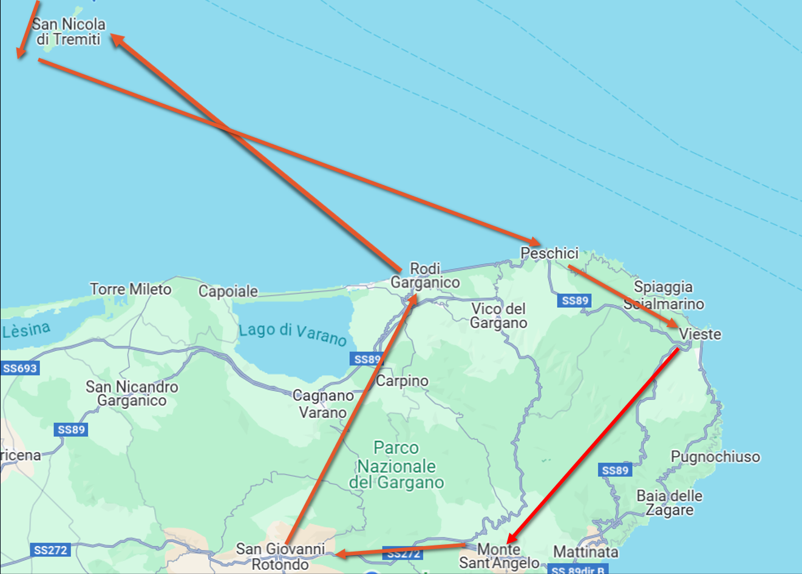
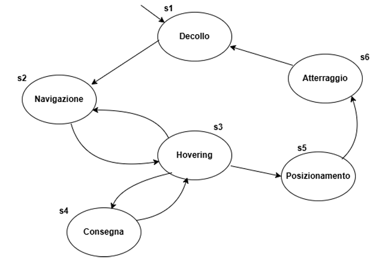

# Drone Medicine Delivery System in Gargano Region

## 📋 Project Overview

This repository contains a **Formal Methods for Security** project that implements a drone-based medicine delivery system for the Gargano region and Tremiti Islands in Italy. The project combines optimization algorithms and formal verification techniques to ensure safe and efficient pharmaceutical delivery to remote areas.

## 🎯 Project Objectives

The project addresses two main challenges:

**a) Route Optimization**: Adapt the Traveling Salesman Problem (TSP) using Answer Set Programming (ASP) to find the optimal delivery path for medical supplies.

**b) Formal Verification**: Model drone maneuvers using Linear Temporal Logic (LTL) and Computation Tree Logic (CTL) to verify system correctness and safety properties.

## 🚁 System Description

### Delivery Scenario
- **Starting Point**: San Giovanni Rotondo Hospital
- **Destinations**: 
  - Coastal locations: Vieste, Peschici, Rodi Garganico
  - Tremiti Islands: San Domino, San Nicola
  - Inland areas: Monte Sant'Angelo
- **Mission**: Autonomous medicine delivery with optimal route planning

### Cost Function
The optimization considers three critical factors:
- **Physical Distance**: Real geographical distances between locations
- **Terrain Factor**: Terrestrial (1.0) vs. Maritime (1.5) flight paths
- **Altitude Factor**: Energy impact based on elevation changes

## 🛠️ Technical Implementation

### ASP-based Route Optimization
- **Technology**: Clingo/Potassco Answer Set Programming
- **Algorithm**: Hamiltonian Cycle optimization with custom cost function
- **Result**: Optimal path minimizing energy consumption and flight time

### Formal Verification with Temporal Logic
- **Drone States**: Takeoff, Navigation, Hovering, Delivery, Positioning, Landing
- **Kripke Structure**: State transition model for drone behavior
- **LTL Properties**: Linear temporal logic for sequential behavior verification
- **CTL Properties**: Computation tree logic for branching behavior analysis
- **Model Checker**: NuSMV for automated property verification

## 📊 Key Results

### Optimal Delivery Route
```
San Giovanni Rotondo → Rodi Garganico → San Nicola → 
San Domino → Peschici → Vieste → Monte Sant'Angelo → Return
```


*Optimal drone delivery route through Gargano region and Tremiti Islands*

### Verified Properties
- ✅ Safe state transitions between drone maneuvers
- ✅ Guaranteed delivery completion from any hovering state
- ✅ Proper return-to-base functionality
- ❌ Counterexample analysis for safety property violations

## 📁 Repository Structure

```
├── droneASP_GiacomoPagliara.lp      # ASP code for route optimization
├── modellazione_drone.smv     # NuSMV model for formal verification
├── Documentazione_GiacomoPagliara.pdf          # Complete project documentation (Italian)
└── README.md                  # This file
```

## 💻 Implementation Details

### ASP Route Optimization Code

The TSP optimization is implemented using the following ASP logic:

```prolog
% Generate possible cycles
{ cycle(X,Y) : edge(X,Y) } = 1 :- node(X).
{ cycle(X,Y) : edge(X,Y) } = 1 :- node(Y).

% Define reachability
reached(Y) :- cycle(start,Y).
reached(Y) :- cycle(X,Y), reached(X).

% Constraints for valid cycle
:- node(Y), not reached(Y).
:- not reached(start).

% Nodes and edges
node(start). % San Giovanni Rotondo
node(1..6). % Vieste(1), Peschici(2), Rodi Garganico(3), San Domino(4), San Nicola(5), Monte Sant'Angelo(6)

% Cost calculation with three factors
cost(X,Y,C) :- distance(X,Y,D), terrain(X,Y,T), alt_cost(X,Y,A),
               C = (D * T / 10) * (1 + A).

% Optimization objective
#minimize { C,X,Y : cycle(X,Y), cost(X,Y,C) }.

#show cycle/2.
```

### Kripke Structure Model

The drone behavior is modeled using the following state space:

```
States: S = {s1, s2, s3, s4, s5, s6}
- s1: Takeoff (Decollo)
- s2: Navigation (Navigazione) 
- s3: Hovering (Hovering)
- s4: Delivery (Consegna)
- s5: Positioning (Posizionamento)
- s6: Landing (Atterraggio)

Transitions: R = {(s1,s2), (s2,s3), (s3,s2), (s3,s4), (s3,s5), (s5,s6), (s6,s1), (s4,s3)}
```


*Kripke Structure*

### NuSMV Verification Model

```smv
MODULE main
VAR
    state : {s1, s2, s3, s4, s5, s6};
    decollo : boolean;
    navigazione : boolean;
    hovering : boolean;
    consegna : boolean;
    posizionamento : boolean;
    atterraggio : boolean;

ASSIGN
    init(state) := s1;
    init(decollo) := TRUE;
    init(navigazione) := FALSE;
    init(hovering) := FALSE;
    init(consegna) := FALSE;
    init(posizionamento) := FALSE;
    init(atterraggio) := FALSE;

    next(state) :=
    case
        state = s1 : s2;
        state = s2 : s3;
        state = s3 : {s2, s4, s5};
        state = s4 : s3;
        state = s5 : s6;
        state = s6 : s1;
    esac;

-- LTL Properties
LTLSPEC G(decollo -> X navigazione)
LTLSPEC G(navigazione -> X hovering)
LTLSPEC G(hovering -> X(navigazione | consegna | posizionamento))
LTLSPEC G(consegna -> X hovering)
LTLSPEC G(posizionamento -> X atterraggio)
LTLSPEC G(atterraggio -> F decollo)

-- CTL Properties  
CTLSPEC AG(EF decollo)
CTLSPEC AG(decollo -> EF consegna)
CTLSPEC AG(!(navigazione & hovering))
CTLSPEC AG(navigazione -> EF hovering)
```

### Temporal Logic Properties

#### LTL Properties (Linear Temporal Logic)
- `G (decollo -> X navigazione)`: After takeoff, next state must be navigation
- `G (navigazione -> X hovering)`: After navigation, next state must be hovering  
- `G (hovering -> X (navigazione ∨ consegna ∨ posizionamento))`: From hovering, next state can be navigation, delivery, or positioning
- `G (consegna -> X hovering)`: After delivery, always return to hovering
- `G (posizionamento -> X atterraggio)`: After positioning, landing must follow
- `G (atterraggio -> F decollo)`: After landing, eventually return to takeoff

#### CTL Properties (Computation Tree Logic)
- `AG (EF decollo)`: From every state, it's always possible to reach takeoff
- `AG (decollo -> EF consegna)`: From takeoff, it's always possible to eventually reach delivery
- `AG ¬(navigazione ∧ hovering)`: Cannot be simultaneously in navigation and hovering
- `AG (navigazione -> EF hovering)`: From navigation, can always eventually reach hovering
- `AG (hovering -> EF (posizionamento ∧ EX atterraggio))`: From hovering, there exists a path to positioning then landing

### Cost Function Analysis

The optimization considers three critical factors:

**Formula**: `C = (D × T / 10) × (1 + A)`

Where:
- **D**: Physical distance in kilometers
- **T**: Terrain factor (1 for land, 15 for sea routes → normalized to 1.5)
- **A**: Altitude factor (|altitude_difference|/100)

**Example Calculation** (San Giovanni Rotondo → Vieste):
- Distance: 55 km
- Terrain: 1 (terrestrial)  
- Altitude difference: |500-40|/100 = 4.6
- **Final Cost**: (55 × 1/10) × (1 + 4.6) = 5.5 × 5.6 = 30.8

### Counterexample Analysis

The project includes verification of property violations:

#### LTL Counterexample
**Property**: `G (decollo -> X navigazione)`  
**Violation**: System remains in takeoff state instead of transitioning to navigation
```
State 1.1: decollo = TRUE, navigazione = FALSE
State 1.2: decollo = TRUE, navigazione = FALSE  (violation)
```

#### CTL Counterexample  
**Property**: `AG (hovering -> E (hovering U (consegna ∨ posizionamento)))`  
**Violation**: From hovering, system transitions directly to landing without delivery/positioning
```
State 3.1: hovering = TRUE
State 3.2: navigazione = TRUE  
State 3.3: hovering = TRUE
State 3.4: atterraggio = TRUE  (violation - no delivery path)
```

## 🔧 Technologies Used

- **ASP (Answer Set Programming)** - Route optimization
- **Clingo/Potassco** - Logic programming solver
- **NuSMV** - Model checker for temporal logic verification
- **LTL/CTL** - Temporal logic specifications
- **Kripke Structures** - State transition modeling

## 🌍 Real-World Applications

This project demonstrates the application of formal methods to:
- **Medical Emergency Response** in remote areas
- **Autonomous Vehicle Path Planning**
- **Safety-Critical System Verification**
- **Geographic Constraint Optimization**

## 🎓 Academic Context

**Course**: Formal Methods for Security  
**University**: University of Bari Aldo Moro   
**Focus**: Formal verification and optimization in safety-critical systems  

---

*This project showcases the integration of optimization algorithms and formal verification techniques for real-world autonomous systems, with particular emphasis on safety and efficiency in medical delivery services.*